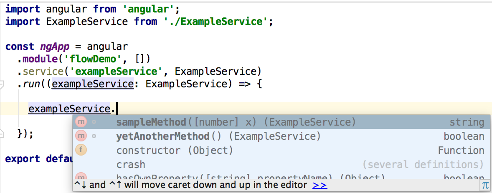

# angular-flowtype-demo
A simple demo showing how you can use flowtype annotations in your angular 1 app

### Motivations
* Autocomplete of methods + type hints in your IDE
* An alternative to typescript for people using babel
* Solves the problem of angulars global DI of "Where is this service defined"

### Requirements
* An IDE that supports flow (e.g. webstorm 11 or sublime)
* Babel (including the `babel-plugin-transform-flow-strip-types` plugin)
* If using eslint you will need to use the [babel parser](https://github.com/babel/babel-eslint)

